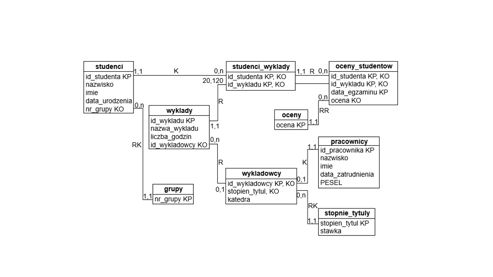

## PROJECTION, SELECTION, SORTING
```sql
--1.01
SELECT id_studenta, data_egzaminu
FROM oceny_studentow
ORDER BY data_egzaminu DESC;

--1.02
SELECT id_studenta
FROM oceny_studentow
WHERE data_egzaminu >= '2017-03-01' AND data_egzaminu <= '2017-03-31';

--1.03
SELECT *
FROM pracownicy
WHERE PESEL IS NULL OR data_zatrudnienia IS NULL;

--1.03
SELECT nazwisko, imie, data_urodzenia, nr_grupy
FROM studenci
WHERE nr_grupy NOT LIKE '%01%'
ORDER BY nazwisko, imie;

--1.05
SELECT COUNT(id_wykladowcy) AS liczba_wykladowcow
FROM wykladowcy;

--1.06
SELECT SUM(liczba_godzin) AS suma_godzin
FROM wyklady;

--1.07
SELECT imie, nazwisko, data_urodzenia
FROM studenci
WHERE MONTH(data_urodzenia) = 2
ORDER BY data_urodzenia;

--1.08
SELECT id_studenta AS student_wykladowca, nr_grupy AS grupa_katedra
FROM studenci
WHERE nr_grupy LIKE 'DMIe%'
UNION
SELECT id_wykladowcy, katedra
FROM wykladowcy
ORDER BY grupa_katedra;

--1.09
SELECT COUNT(id_wykladu) AS ZLiteraM
FROM wyklady
WHERE nazwa_wykladu LIKE '%m%';

--1.10
SELECT id_studenta, id_wykladu
FROM studenci_wyklady
EXCEPT
SELECT id_studenta, id_wykladu
FROM oceny_studentow
WHERE ocena IS NOT NULL;

--1.11
SELECT id_studenta
FROM studenci_wyklady
WHERE id_wykladu = 4
INTERSECT
SELECT id_studenta
FROM studenci_wyklady
WHERE id_wykladu = 11;

--1.12a
SELECT id_wykladowcy
FROM wykladowcy
WHERE stopien_tytul = 'doktor';

--1.12b
SELECT id_wykladowcy
FROM wykladowcy
WHERE stopien_tytul = 'doktor'
INTERSECT
SELECT id_wykladowcy
FROM wyklady;

--1.12c
SELECT id_wykladowcy
FROM wykladowcy
WHERE stopien_tytul = 'doktor'
EXCEPT
SELECT id_wykladowcy
FROM wyklady;

--1.13
SELECT COUNT(id_wykladu) AS liczba_wykladow, SUM(liczba_godzin) AS liczba_godzin
FROM wyklady
WHERE nazwa_wykladu LIKE 'In%';

--1.14
SELECT COUNT(id_pracownika) AS brak_danych
FROM pracownicy
WHERE PESEL IS NULL AND data_zatrudnienia IS NULL;

--1.15
SELECT MAX(data_egzaminu) AS ostatni_egzamin
FROM oceny_studentow;

--1.16
SELECT COUNT(id_wykladowcy)
FROM wykladowcy
WHERE stopien_tytul = 'doktor' AND katedra = 'Katedra Informatyki';

--1.17
SELECT nr_grupy
FROM grupy
WHERE nr_grupy LIKE '__[iz]%';

--1.18
SELECT nr_grupy
FROM grupy
WHERE nr_grupy LIKE '[^D]%';
```
## JOINS, NEGATIVE QUERIES, UNIONS, ALIASES
``` sql
--2.01
SELECT nazwa_wykladu, liczba_godzin, id_pracownika, nazwisko, imie
FROM wyklady 
LEFT JOIN pracownicy ON wyklady.id_wykladowcy = pracownicy.id_pracownika
ORDER BY nazwa_wykladu, nazwisko, imie

--2.02
SELECT nazwisko, imie
FROM studenci 
INNER JOIN studenci_wyklady ON studenci.id_studenta = studenci_wyklady.id_studenta 
INNER JOIN wyklady ON studenci_wyklady.id_wykladu = wyklady.id_wykladu
WHERE nazwa_wykladu = 'Statystyka'
ORDER BY nazwisko, imie

--2.03
SELECT DISTINCT nazwisko, imie, studenci.id_studenta, data_egzaminu
FROM studenci 
INNER JOIN studenci_wyklady ON studenci.id_studenta = studenci_wyklady.id_studenta
INNER JOIN oceny_studentow ON oceny_studentow.id_studenta = studenci_wyklady.id_studenta
ORDER BY data_egzaminu

--2.04
SELECT nazwisko, imie, stopien_tytul
FROM pracownicy 
INNER JOIN wykladowcy ON pracownicy.id_pracownika = wykladowcy.id_wykladowcy
WHERE katedra = 'Katedra Informatyki'
ORDER BY nazwisko, imie

--2.05
SELECT nazwisko, imie, katedra
FROM pracownicy 
LEFT JOIN wykladowcy ON pracownicy.id_pracownika = wykladowcy.id_wykladowcy
ORDER BY nazwisko, imie DESC

--2.06
SELECT id_pracownika, nazwisko, imie
FROM pracownicy
WHERE id_pracownika IN (
    SELECT id_wykladowcy
    FROM wykladowcy
    WHERE id_wykladowcy NOT IN (
        SELECT id_wykladowcy
        FROM wyklady
    )
)
ORDER BY id_pracownika DESC

--2.07
SELECT studenci.imie, studenci.nazwisko, nazwa_wykladu, pracownicy.nazwisko AS NazwiskoWykladowcy, katedra    
FROM studenci 
LEFT JOIN studenci_wyklady ON studenci.id_studenta = studenci_wyklady.id_studenta
LEFT JOIN wyklady ON studenci_wyklady.id_wykladu = wyklady.id_wykladu
LEFT JOIN wykladowcy ON wyklady.id_wykladowcy = wykladowcy.id_wykladowcy
LEFT JOIN pracownicy ON wykladowcy.id_wykladowcy = pracownicy.id_pracownika
ORDER BY nazwa_wykladu DESC, NazwiskoWykladowcy

--2.08
SELECT SUM(stawka * liczba_godzin) AS wyplaty
FROM stopnie_tytuly 
INNER JOIN wykladowcy ON stopnie_tytuly.stopien_tytul = wykladowcy.stopien_tytul
INNER JOIN wyklady ON wykladowcy.id_wykladowcy = wyklady.id_wykladowcy

--2.09
SELECT id_wykladu, nazwa_wykladu
FROM wyklady
WHERE id_wykladu NOT IN (
    SELECT id_wykladu
    FROM studenci_wyklady
)
ORDER BY nazwa_wykladu DESC

--2.10
SELECT nazwa_wykladu, liczba_godzin, nazwisko, katedra
FROM wyklady 
INNER JOIN wykladowcy ON wyklady.id_wykladowcy = wykladowcy.id_wykladowcy
INNER JOIN pracownicy ON wykladowcy.id_wykladowcy = pracownicy.id_pracownika
WHERE nazwa_wykladu LIKE 'Historia%'
ORDER BY nazwisko DESC

--2.11
SELECT nazwisko, imie, PESEL AS pesel_grupa, nazwa_wykladu
FROM wyklady 
INNER JOIN pracownicy ON wyklady.id_wykladowcy = pracownicy.id_pracownika
UNION
SELECT nazwisko, imie, nr_grupy, nazwa_wykladu
FROM studenci 
LEFT JOIN studenci_wyklady ON studenci.id_studenta = studenci_wyklady.id_studenta
LEFT JOIN wyklady ON studenci_wyklady.id_wykladu = wyklady.id_wykladu
ORDER BY pesel_grupa, nazwisko, imie

--2.12
SELECT id_pracownika, nazwisko, imie
FROM pracownicy
WHERE id_pracownika NOT IN (
    SELECT id_wykladowcy
    FROM wykladowcy
)
ORDER BY nazwisko DESC, imie

--2.13
SELECT id_studenta 
FROM studenci
WHERE id_studenta IN (
    SELECT id_studenta
    FROM oceny_studentow
    WHERE data_egzaminu LIKE '2017-04-12'
    INTERSECT
    SELECT id_studenta
    FROM oceny_studentow
    WHERE data_egzaminu LIKE '2017-10-11'
)
ORDER BY id_studenta DESC

--2.14
SELECT studenci_wyklady.id_studenta, nazwisko, nazwa_wykladu
FROM studenci_wyklady 
INNER JOIN studenci ON studenci_wyklady.id_studenta = studenci.id_studenta
INNER JOIN wyklady ON studenci_wyklady.id_wykladu = wyklady.id_wykladu

--2.15
SELECT imie, nazwisko, id_studenta
FROM studenci
WHERE id_studenta IN (
    SELECT id_studenta
    FROM studenci_wyklady
    WHERE id_wykladu = 4
    INTERSECT
    SELECT id_studenta
    FROM studenci_wyklady
    WHERE id_wykladu = 11
)

--2.16
SELECT DISTINCT studenci_wyklady.id_wykladu, nazwa_wykladu
FROM studenci_wyklady 
INNER JOIN wyklady ON studenci_wyklady.id_wykladu = wyklady.id_wykladu
WHERE studenci_wyklady.id_wykladu NOT IN (
    SELECT id_wykladu
    FROM oceny_studentow
)
```
## GROUPING AND AGGREGATE FUNCTIONS
``` sql
--3.01
SELECT nr_grupy, COUNT(id_studenta) AS Liczba_studentow
FROM studenci
GROUP BY nr_grupy
ORDER BY Liczba_studentow

--3.02
SELECT nr_grupy, COUNT(id_studenta) AS Liczba_studentow
FROM studenci
GROUP BY nr_grupy
HAVING COUNT(id_studenta) >= 3
ORDER BY Liczba_studentow

--3.03
SELECT id_studenta, imie, nazwisko, nr_grupy
FROM studenci 
WHERE id_studenta NOT IN (
    SELECT id_studenta
    FROM studenci_wyklady
)
ORDER BY nazwisko DESC, imie DESC

--3.04
SELECT DISTINCT imie, nazwisko, nr_grupy
FROM studenci
LEFT JOIN studenci_wyklady ON studenci.id_studenta = studenci_wyklady.id_studenta
INNER JOIN wyklady ON studenci_wyklady.id_wykladu = wyklady.id_wykladu
WHERE nr_grupy LIKE 'DMIe%' AND nazwa_wykladu NOT LIKE 'Statystyka'

--3.05
SELECT nazwisko, imie, AVG(ocena) AS Srednia
FROM studenci
INNER JOIN oceny_studentow ON studenci.id_studenta = oceny_studentow.id_studenta
GROUP BY nazwisko, imie, oceny_studentow.id_studenta
HAVING nazwisko = 'Nowakowski'
ORDER BY nazwisko DESC, imie DESC

--3.06
SELECT nazwisko, imie, AVG(ocena) AS Srednia
FROM pracownicy p
INNER JOIN wykladowcy w ON p.id_pracownika = w.id_wykladowcy
INNER JOIN wyklady ww ON w.id_wykladowcy = ww.id_wykladowcy
LEFT JOIN oceny_studentow o ON ww.id_wykladu = o.id_wykladu
GROUP BY nazwisko, imie
ORDER BY Srednia DESC

--3.07
SELECT studenci.id_studenta, nazwisko, imie, COUNT(id_wykladu)
FROM studenci
INNER JOIN studenci_wyklady ON studenci.id_studenta = studenci_wyklady.id_studenta
GROUP BY studenci.id_studenta, nazwisko, imie
HAVING COUNT(id_wykladu) = 1
ORDER BY id_studenta

--3.08
SELECT DISTINCT o.ocena, COUNT(os.ocena) AS Liczba_ocen
FROM oceny o
LEFT JOIN oceny_studentow os ON o.ocena = os.ocena
GROUP BY o.ocena
ORDER BY ocena DESC

--3.09
SELECT nazwa_wykladu, SUM(liczba_godzin * stawka) AS kwota_na_wyplaty
FROM wyklady w
INNER JOIN wykladowcy wd ON w.id_wykladowcy = wd.id_wykladowcy
INNER JOIN stopnie_tytuly st ON wd.stopien_tytul = st.stopien_tytul
WHERE nazwa_wykladu LIKE 'Informatyka' OR nazwa_wykladu LIKE 'Statystyka'
GROUP BY nazwa_wykladu

--3.10
SELECT nazwisko, imie, SUM(liczba_godzin) AS Liczba_godzin
FROM pracownicy p
INNER JOIN wykladowcy wd ON p.id_pracownika = wd.id_wykladowcy
LEFT JOIN wyklady w ON wd.id_wykladowcy = w.id_wykladowcy
GROUP BY nazwisko, imie
ORDER BY Liczba_godzin DESC

--3.11
SELECT DISTINCT nazwa_wykladu, data_egzaminu 
FROM wyklady w
INNER JOIN oceny_studentow sw ON w.id_wykladu = sw.id_wykladu
WHERE nazwa_wykladu LIKE 'Historia'
ORDER BY data_egzaminu DESC

--3.12
SELECT g.nr_grupy, COUNT(id_studenta) AS LiczbaStudentow
FROM grupy g
LEFT JOIN studenci s ON g.nr_grupy = s.nr_grupy
GROUP BY g.nr_grupy
ORDER BY LiczbaStudentow

--3.13
SELECT nazwa_wykladu, COUNT(id_studenta) AS Liczba_studentow
FROM wyklady w
LEFT JOIN studenci_wyklady sw ON w.id_wykladu = sw.id_wykladu
WHERE nazwa_wykladu LIKE 'Historia%'
GROUP BY nazwa_wykladu
ORDER BY Liczba_studentow DESC

--3.14
SELECT nazwa_wykladu, AVG(ocena) AS Srednia
FROM wyklady w
LEFT JOIN oceny_studentow os ON w.id_wykladu = os.id_wykladu
GROUP BY nazwa_wykladu, w.id_wykladu
HAVING nazwa_wykladu = 'Informatyka'

--3.15 
SELECT nr_grupy, COUNT(studenci.id_studenta) AS LiczbaStudentow, AVG(ocena) AS srednia
FROM studenci
LEFT JOIN oceny_studentow ON studenci.id_studenta = oceny_studentow.id_studenta
GROUP BY nr_grupy
ORDER BY srednia DESC

--3.16
SELECT nazwisko, imie, SUM(liczba_godzin * stawka) AS Naleznosci
FROM pracownicy p
INNER JOIN wykladowcy wd ON p.id_pracownika = wd.id_wykladowcy
INNER JOIN stopnie_tytuly st ON wd.stopien_tytul = st.stopien_tytul
INNER JOIN wyklady w ON wd.id_wykladowcy = w.id_wykladowcy
GROUP BY nazwisko, imie
ORDER BY nazwisko, imie

--3.17
SELECT nazwisko, imie, katedra, COUNT(id_wykladu) AS Liczba_wykladow
FROM pracownicy p
INNER JOIN wykladowcy wd ON p.id_pracownika = wd.id_wykladowcy
LEFT JOIN wyklady w ON wd.id_wykladowcy = w.id_wykladowcy
GROUP BY nazwisko, imie, katedra
ORDER BY nazwisko

--3.18
SELECT katedra, SUM(liczba_godzin) AS Liczba_godzin
FROM wykladowcy wd
LEFT JOIN wyklady w ON wd.id_wykladowcy = w.id_wykladowcy
GROUP BY katedra
ORDER BY Liczba_godzin

--3.19
SELECT nazwa_wykladu, COUNT(ocena)
FROM wyklady w
INNER JOIN oceny_studentow os ON w.id_wykladu = os.id_wykladu
GROUP BY nazwa_wykladu
HAVING COUNT(ocena) >= 2 
ORDER BY nazwa_wykladu DESC

